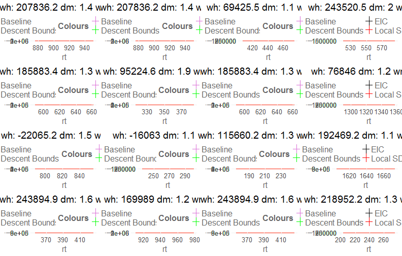
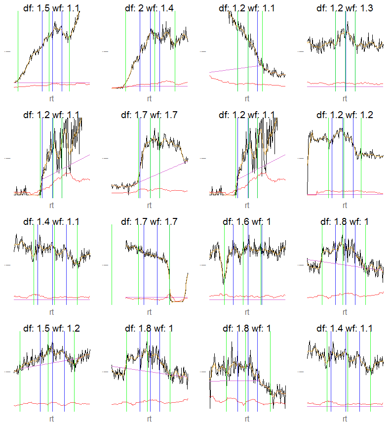
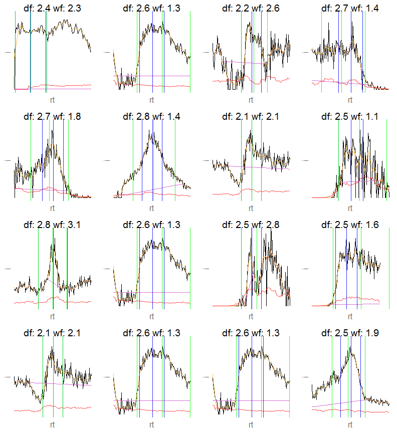
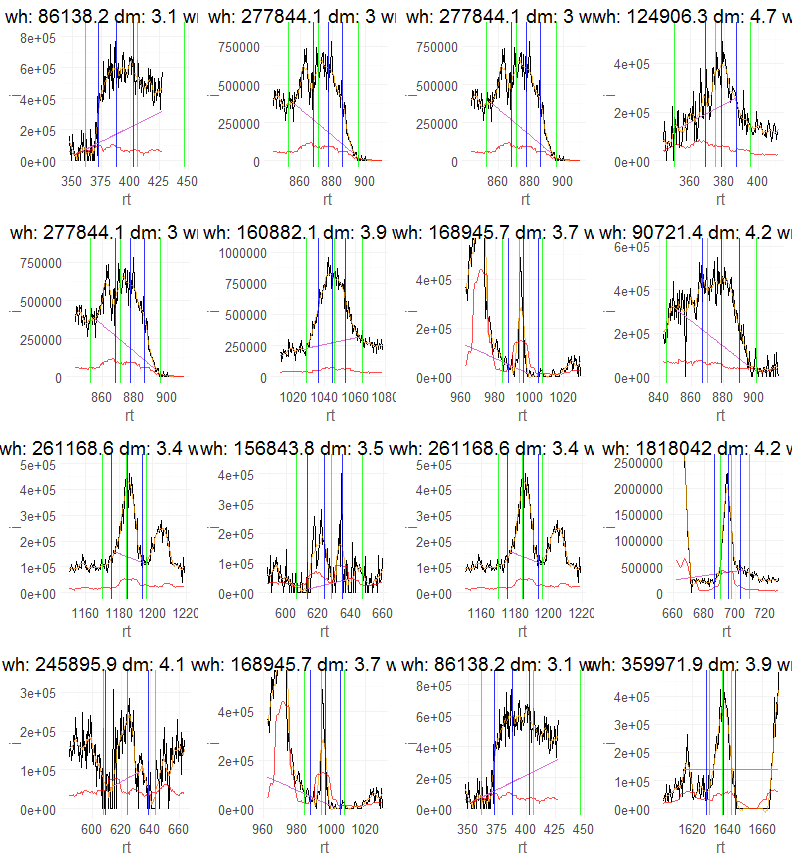
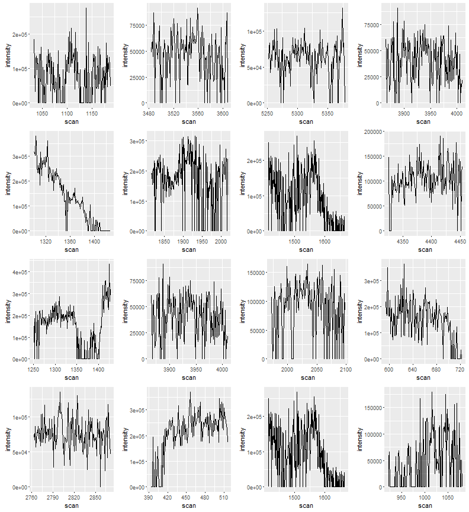
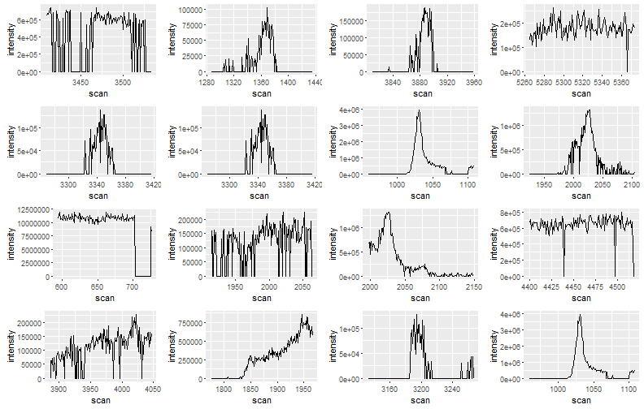
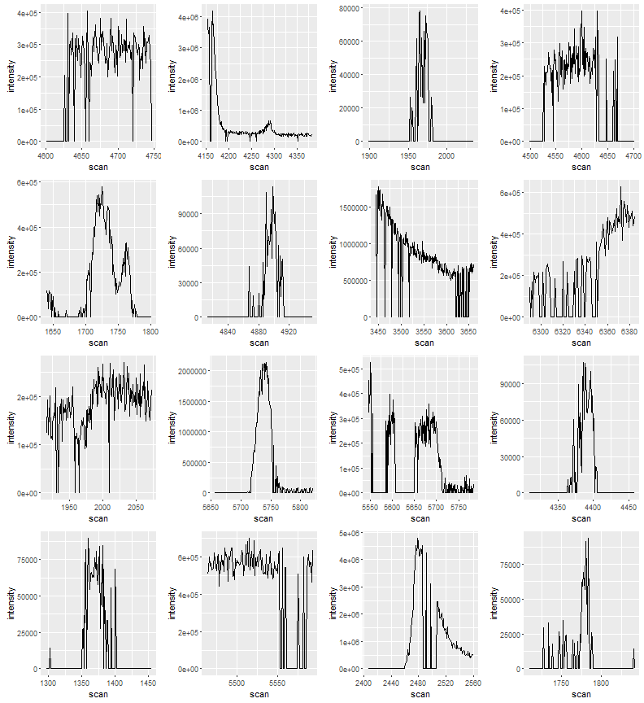
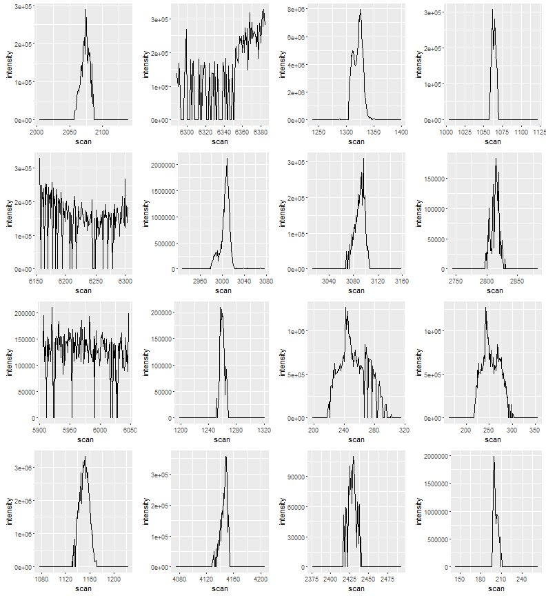

# xcms::findPeaks.centWave vs centWaveP


```r
library(centWaveP)
library(xcms)
library(gridExtra)
```

## centWaveP

```r
file = "../../../Projects/Datasets/2nm118a_nh2_negative_ecoli_1213/2NM118A_HILICAnnoWgN14_2NM111G_12.mzXML"

xr = xcmsRaw(file, profstep=0)

roi.l = cent.xr(xr, ppm = 2, prefilter = c(4,0), maxskip = 5) # ppm is added to both sides
```

```
##  % finished: 0 10 20 30 40 50 60 70 80 90 100 
##  252768 m/z ROI's.
```

```r
eic.l = lapply(sample(roi.l, 3000), roiToEic, xr, padding=100)
eic.noise.l = lapply(eic.l, estimateBaselineNoise, peakwidth = c(15, 60), minslope.peak = 20000)

peaks = lapply(seq_along(eic.noise.l), function(i) {
  wave(eic.noise.l[[i]], peakwidth = c(15, 70), valleywidth.min = 15, sensitivity = 1, smooth = T)
})

index = lapply(seq(peaks), function(i) {
  wns = peaks[[i]]$descent.fold.above.descentbaseline
  cbind(roi = rep(i, length(wns)), wsn = wns, num = seq_along(wns))
  }) %>% do.call(what = rbind)

nrow(index)
```

```
## [1] 136
```


### SN < 1

```r
ps0 = lapply(sample(which(index[,"wsn"] < 1), 16, replace = T), function(x) {
  plotWavePeak(unname(index[x, "num"]), eic.noise.l[[index[x,"roi"]]], peaks[[index[x,"roi"]]])
})
do.call(grid.arrange, ps0)  
```


### 1 < SN < 2

```r
ps1 = lapply(sample(index[,"wsn"] %>% { which(. > 1  & . < 2) }, 16, replace = T), function(x) {
  plotWavePeak(unname(index[x, "num"]), eic.noise.l[[index[x,"roi"]]], peaks[[index[x,"roi"]]])
})
do.call(grid.arrange, ps1)  
```


### 2 < SN < 3

```r
ps2 = lapply(sample(index[,"wsn"] %>% { which(. > 2  & . < 3) }, 16, replace = T), function(x) {
  plotWavePeak(unname(index[x, "num"]), eic.noise.l[[index[x,"roi"]]], peaks[[index[x,"roi"]]])
})
do.call(grid.arrange, ps2)
```


### 3 < SN < 4

```r
ps3 = lapply(sample(index[,"wsn"] %>% { which(. > 3  & . < 5) }, 16, replace = T), function(x) {
  plotWavePeak(unname(index[x, "num"]), eic.noise.l[[index[x,"roi"]]], peaks[[index[x,"roi"]]])
})
do.call(grid.arrange, ps3)
```


### 5 < SN 

```r
ps4 = lapply(sample(index[,"wsn"] %>% { which(. > 5) }, 16, replace=T), function(x) {
  plotWavePeak(unname(index[x, "num"]), eic.noise.l[[index[x,"roi"]]], peaks[[index[x,"roi"]]])
})
do.call(grid.arrange, ps4)
```


## xcms::findPeaks.centWave

```r
ROI.list = xcms:::findmzROI(xr, dev = 2*1E-6, minCentroids = 4, prefilter = c(4,0), noise = 0)
```

```
##  % finished: 0 10 20 30 40 50 60 70 80 90 100 
##  319716 m/z ROI's.
```

```r
peaks.xcms = findPeaks.centWave(xr, ppm = 2, peakwidth = c(15, 60), snthresh = 0, prefilter = c(4,0), noise = 0, ROI.list = sample(ROI.list, 3000))
```

```
## 
##  Detecting chromatographic peaks ... 
##  % finished: 0 10 20 30 40 50 60 70 80 90 100 
##  441  Peaks.
```

```r
nrow(peaks.xcms)
```

```
## [1] 441
```

```r
head(peaks.xcms)
```

```
##            mz    mzmin    mzmax       rt    rtmin    rtmax      into
## [1,] 612.8240 612.8233 612.8246  962.053  954.758  967.675 1594222.6
## [2,] 207.0390 207.0389 207.0394  129.254  122.483  137.122  799475.6
## [3,] 328.1153 328.1151 328.1157 2000.120 1984.260 2011.440 8815864.7
## [4,] 328.1153 328.1151 328.1157 2000.120 1984.260 2011.440 8815864.7
## [5,] 544.3498 544.3492 544.3505 1243.640 1242.510 1282.070 4271358.7
## [6,] 544.3495 544.3488 544.3503 1179.240 1178.670 1179.800  207298.2
##           intb     maxo     sn
## [1,] 1594210.2 221493.9 221493
## [2,]  786179.0 155846.3     12
## [3,] 8815837.5 777535.7 777535
## [4,] 8815837.5 777535.7 777535
## [5,] 3195635.5 154251.5      5
## [6,]  159851.8 135370.6      6
```


### 1 < SN < 5

```r
 ps4 = lapply(sample(peaks.xcms[,"sn"] %>% { which(. > 1 & . < 5) }, 16, replace=T), function(i) {
   scrange = c(peaks.xcms[i,"rtmin"]-30, peaks.xcms[i,"rtmax"]+30)
   scrange[scrange < 1] = 1; scrange[scrange > max(xr@scantime)] = max(xr@scantime)
    eic = rawEIC(xr, mzrange = c(peaks.xcms[i,"mzmin"], peaks.xcms[i,"mzmax"]), rtrange = scrange)
   
    df = data.frame(eic)
    
    ggplot(df) +
      geom_line(aes(x = scan, y = intensity))
   })
do.call(grid.arrange, ps4)
```


### 5 < SN < 10

```r
 ps4 = lapply(sample(peaks.xcms[,"sn"] %>% { which(. > 5 & . < 10) }, 16, replace=T), function(i) {
   scrange = c(peaks.xcms[i,"rtmin"]-30, peaks.xcms[i,"rtmax"]+30)
   scrange[scrange < 1] = 1; scrange[scrange > max(xr@scantime)] = max(xr@scantime)
    eic = rawEIC(xr, mzrange = c(peaks.xcms[i,"mzmin"], peaks.xcms[i,"mzmax"]), rtrange = scrange)
   
    df = data.frame(eic)
    
    ggplot(df) +
      geom_line(aes(x = scan, y = intensity))
   })
do.call(grid.arrange, ps4)
```


### 10 < SN < 100

```r
 ps4 = lapply(sample(peaks.xcms[,"sn"] %>% { which(. > 10 & . < 100) }, 16, replace=T), function(i) {
   scrange = c(peaks.xcms[i,"rtmin"]-30, peaks.xcms[i,"rtmax"]+30)
   scrange[scrange < 1] = 1; scrange[scrange > max(xr@scantime)] = max(xr@scantime)
    eic = rawEIC(xr, mzrange = c(peaks.xcms[i,"mzmin"], peaks.xcms[i,"mzmax"]), rtrange = scrange)
   
    df = data.frame(eic)
    
    ggplot(df) +
      geom_line(aes(x = scan, y = intensity))
   })
do.call(grid.arrange, ps4)
```


### SN > 100

```r
 ps4 = lapply(sample(peaks.xcms[,"sn"] %>% { which(. > 100) }, 16, replace=T), function(i) {
   scrange = c(peaks.xcms[i,"rtmin"]-30, peaks.xcms[i,"rtmax"]+30)
   scrange[scrange < 1] = 1; scrange[scrange > max(xr@scantime)] = max(xr@scantime)
    eic = rawEIC(xr, mzrange = c(peaks.xcms[i,"mzmin"], peaks.xcms[i,"mzmax"]), rtrange = scrange)
   
    df = data.frame(eic)
    
    ggplot(df) +
      geom_line(aes(x = scan, y = intensity))
   })
do.call(grid.arrange, ps4)
```


