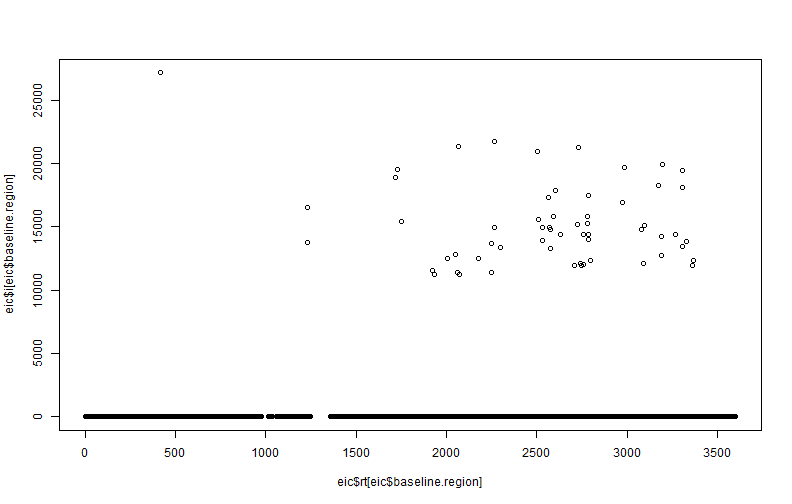
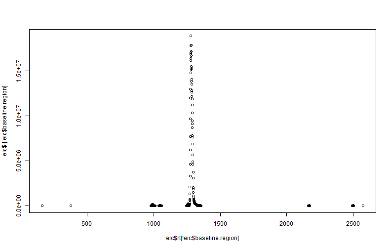
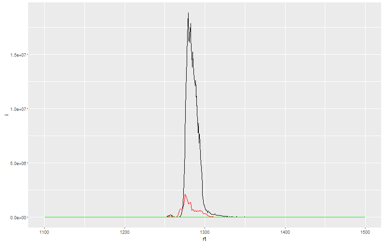
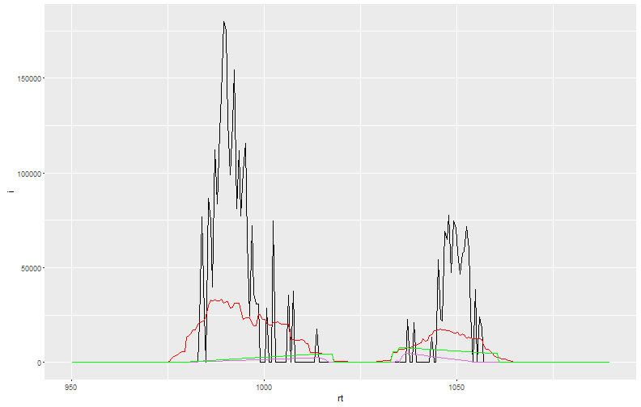
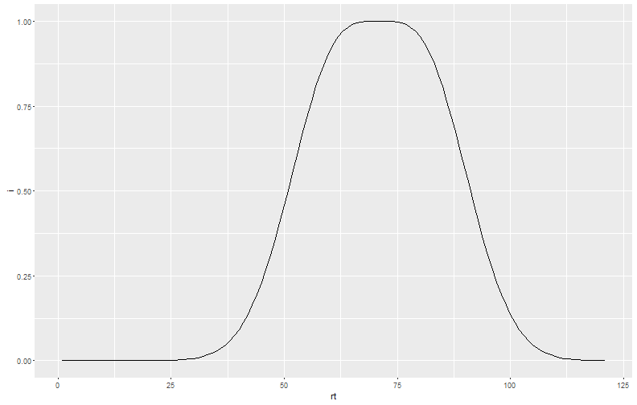
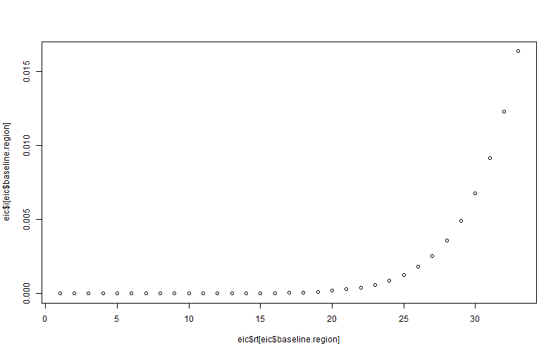
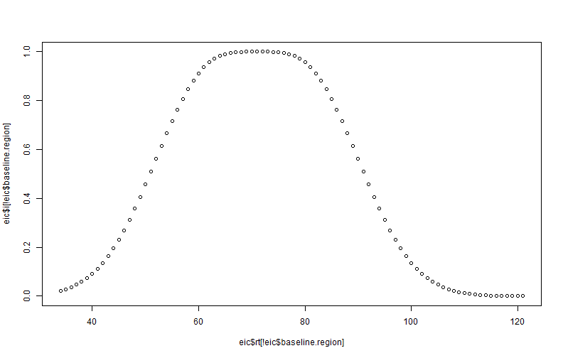
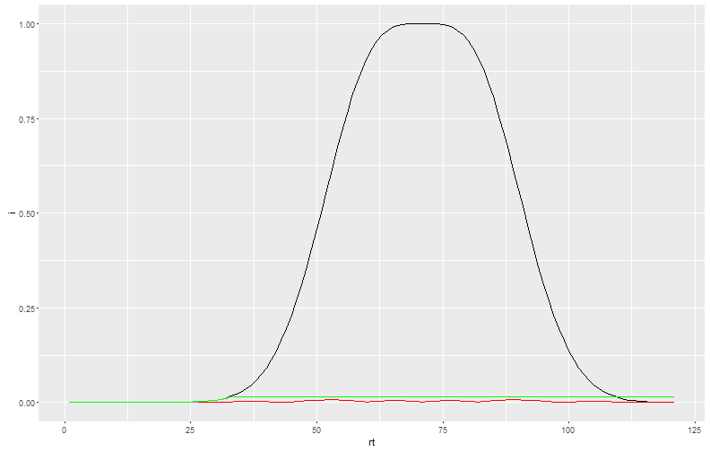
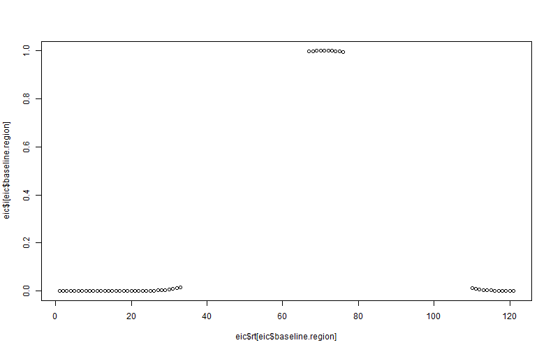
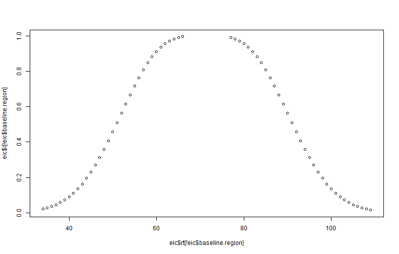

# Baseline Estimations


```r
library(centWaveP)
library(ggplot2)
```

## HILIC, 60 minute gradient, 150 mm x 1 mm x 3 um, 50 uL/min

```r
eic = readRDS("eic.rds")

ggplot(eic) + 
  geom_line(aes(x = rt, y = i))
```


```r
ggplot(subset(eic,abs(rt - 1300) < 200)) + 
  geom_line(aes(x = rt, y = i))
```


```r
eic.n = estimateBaselineNoise(eic, peakwidth = c(15,70), minslope.peak = 2000, plot.tf = T)
```



```r
ggplot(subset(eic.n, abs(rt - 1300) < 200)) + 
  geom_line(aes(x = rt, y = i)) +
  geom_line(aes(x = rt, y =noise.local.sd), colour = "red") +
  geom_line(aes(x = rt, y =baseline), colour = "orchid") +
  geom_line(aes(x = rt, y =noise.baseline.sd), colour = "green")
```



```r
ggplot(subset(eic.n,abs(rt - 1020) < 70)) + 
  geom_line(aes(x = rt, y = i)) +
  geom_line(aes(x = rt, y =noise.local.sd), colour = "red") +
  geom_line(aes(x = rt, y =baseline), colour = "orchid") +
  geom_line(aes(x = rt, y =noise.baseline.sd), colour = "green")
```



## Plateau peak

```r
eic = { dnorm(seq(-6, 6, by =0.1)) + dnorm(seq(-6, 6, by =0.1), mean = 2) } %>% { ./max(.) }
eic = data.frame( i = eic, rt = seq(eic), scan = seq(eic))

ggplot(eic) + 
  geom_line(aes(x = rt, y = i))
```



```r
eic.n = estimateBaselineNoise(eic, peakwidth = c(15, 70), minslope.peak = .005, plot.tf = T)
```



```r
ggplot(eic.n) + 
  geom_line(aes(x = rt, y = i)) +
  geom_line(aes(x = rt, y =noise.local.sd), colour = "red") +
  geom_line(aes(x = rt, y =baseline), colour = "orchid") +
  geom_line(aes(x = rt, y =noise.baseline.sd), colour = "green")
```



```r
eic.n = estimateBaselineNoise(eic, peakwidth = c(15, 20), minslope.peak = .005, plot.tf = T)
```



```r
ggplot(eic.n) + 
  geom_line(aes(x = rt, y = i)) +
  geom_line(aes(x = rt, y =noise.local.sd), colour = "red") +
  geom_line(aes(x = rt, y =baseline), colour = "orchid") +
  geom_line(aes(x = rt, y =noise.baseline.sd), colour = "green") + main("Inappropriate max peakwidth setting.")
```

```
## Error in eval(expr, envir, enclos): could not find function "main"
```
