# Wavelet Based Peak Detection

```r
library(centWaveP)
library(ggplot2)
```
## HILIC, 60 minute gradient, 150 mm x 1 mm x 3 um, 50 uL/min

```r
eic = readRDS("eic.rds")
eic.n = estimateBaselineNoise(eic, peakwidth = c(15,70), minslope.peak = 10000, plot.tf = T)
```

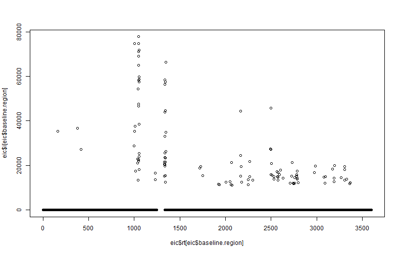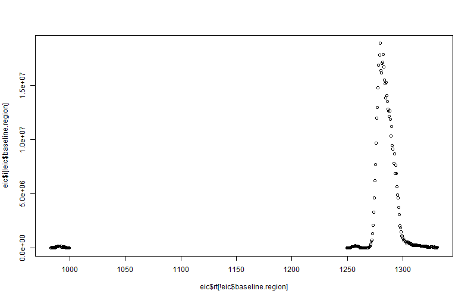

```r
eic.n$inroi=T

ggplot(eic) + 
  geom_line(aes(x = rt, y = i))
```


```r
ggplot(subset(eic.n,abs(rt - 1300) < 200)) + 
  geom_line(aes(x = rt, y = i)) +
  geom_line(aes(x = rt, y =noise.local.sd), colour = "red") +
  geom_line(aes(x = rt, y =baseline), colour = "orchid") +
  geom_line(aes(x = rt, y =noise.baseline.sd), colour = "green")
```


```r
peaks = wave(eic.n, peakwidth = c(5,70), valleywidth.min = 10)
peaks = subset(peaks, descent.fold.above.descentbaseline > 0.95)

for (i in seq_along(peaks[,1])) {
  plotWavePeak(i, eic.n, peaks) %>% print
  #cat ("Press [enter] to continue")
  #line <- readline()
  
  #if (line == "x") {break;}
}
```

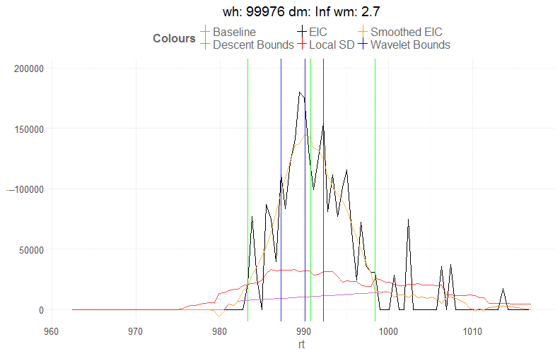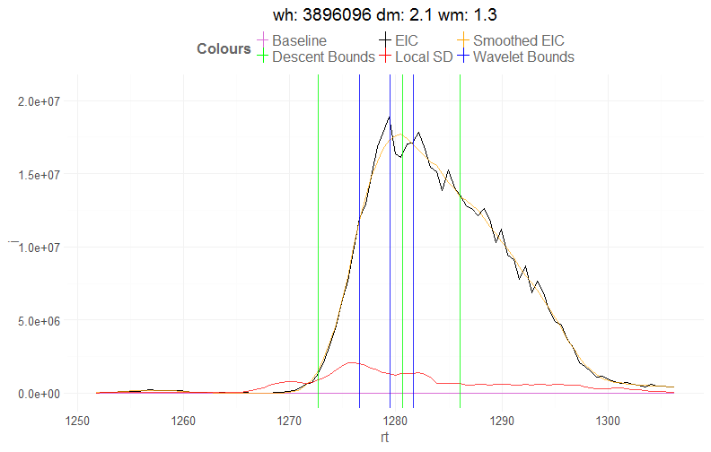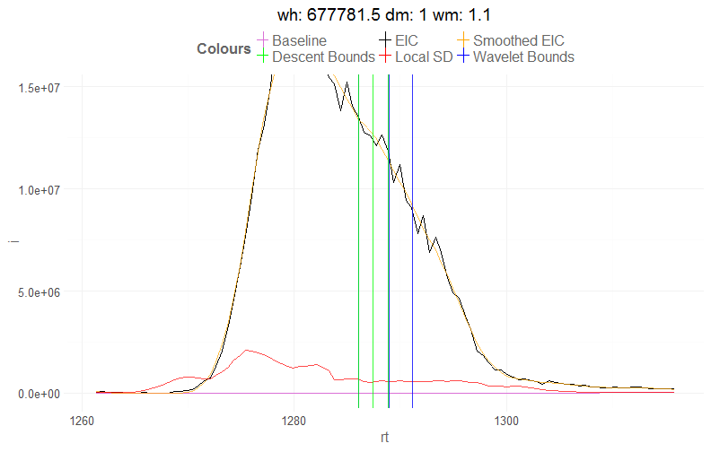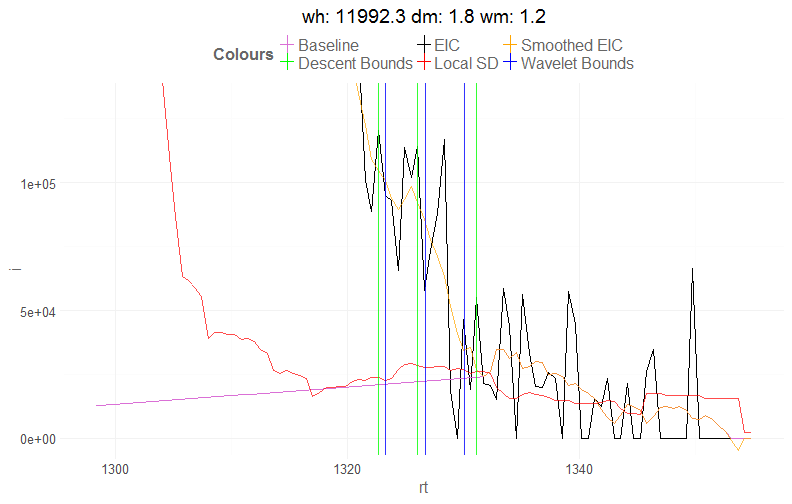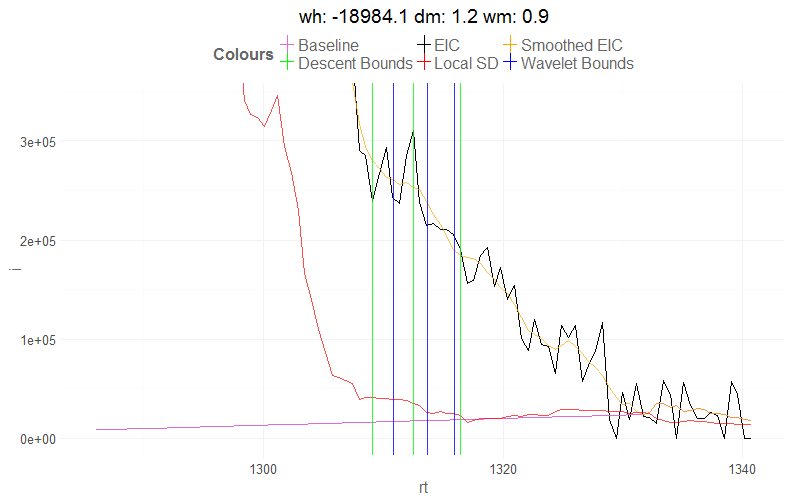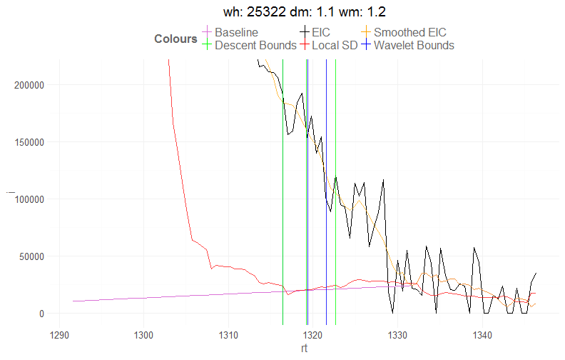


## Plateau peak

```r
eic = { dnorm(seq(-6, 6, by =0.1)) + dnorm(seq(-6, 6, by =0.1), mean = 3) } %>% { ./max(.) }
eic = data.frame( i = eic, rt = seq(eic), scan = seq(eic))
eic$inroi = T

ggplot(eic) + 
  geom_line(aes(x = rt, y = i))
```

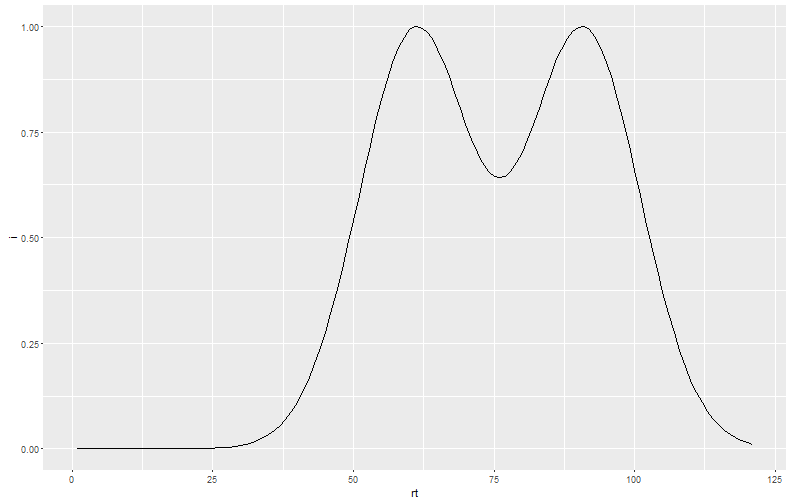

```r
eic.n = estimateBaselineNoise(eic, peakwidth = c(15, 70), minslope.peak = .005, plot.tf = T)
```

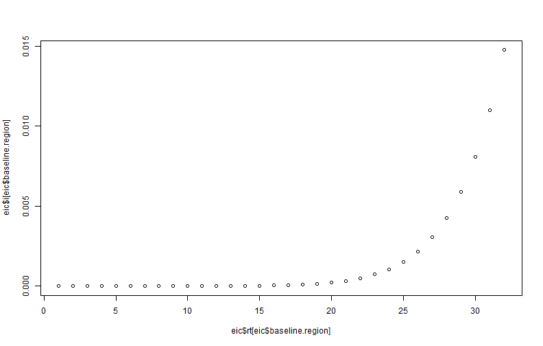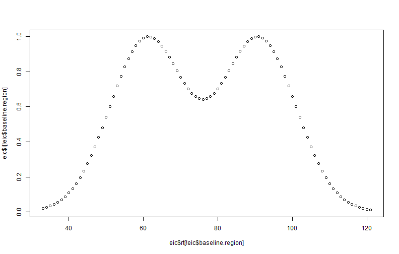

```r
ggplot(eic.n) + 
  geom_line(aes(x = rt, y = i)) +
  geom_line(aes(x = rt, y =noise.local.sd), colour = "red") +
  geom_line(aes(x = rt, y =baseline), colour = "orchid") +
  geom_line(aes(x = rt, y =noise.baseline.sd), colour = "green")
```

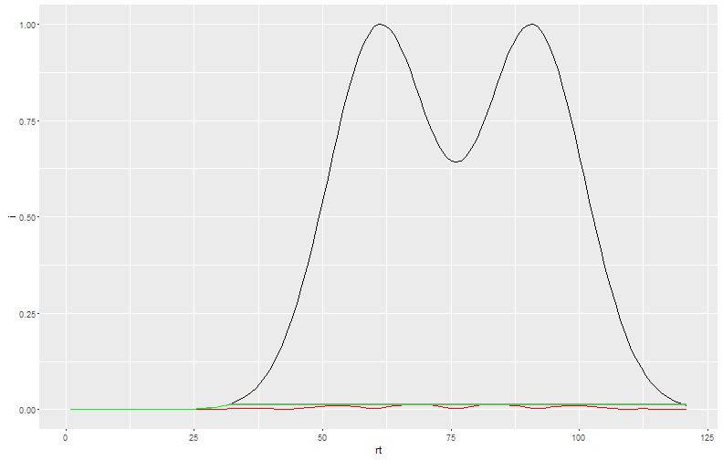

```r
peaks = wave(eic.n, peakwidth = c(5,70), valleywidth.min = 10)


for (i in seq_along(peaks[,1])) {
  plotWavePeak(i, eic.n, peaks) %>% print
}
```

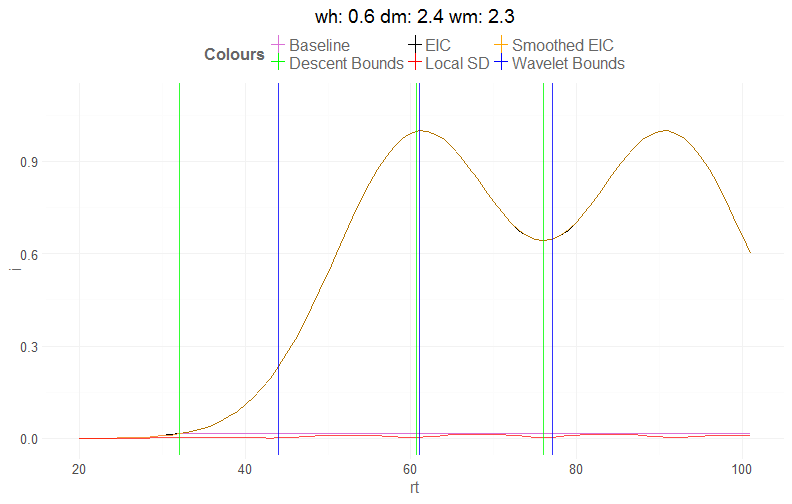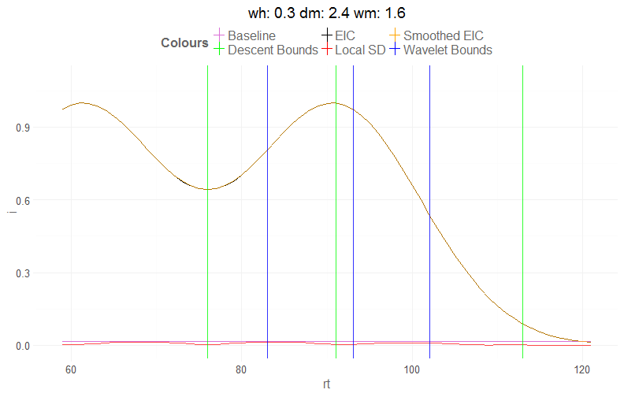
